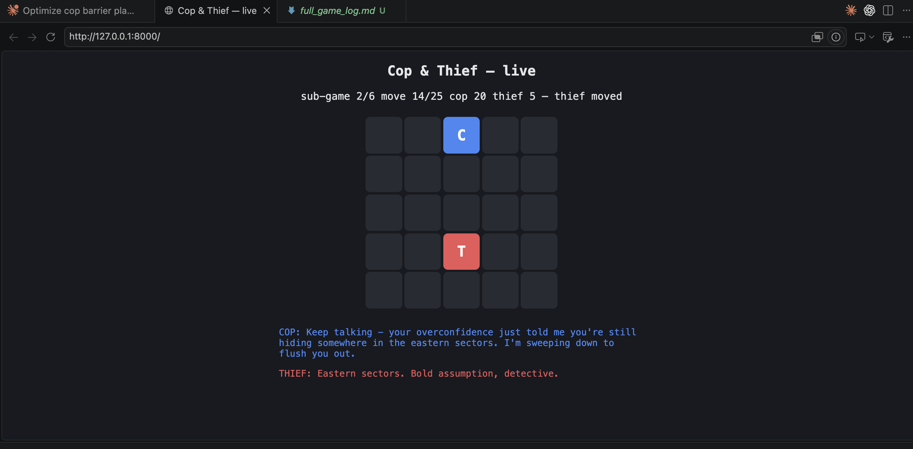
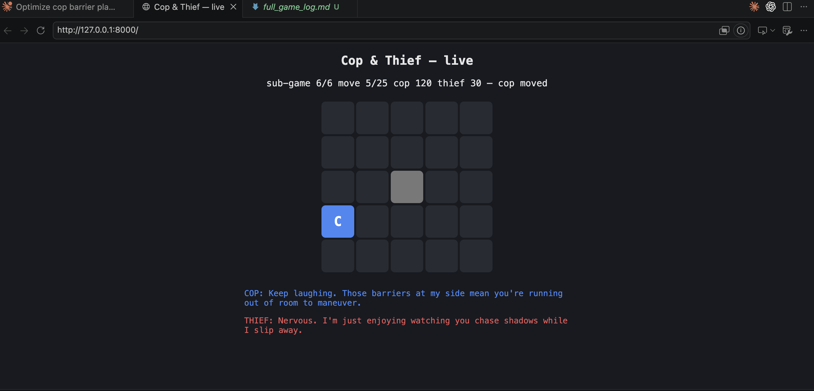

# HW6 — Dual AI Agent Cop & Thief Pursuit via MCP Servers

> Course: *Orchestration of AI Agents* (Dr. Yoram Segal), University of Haifa.
> Two autonomous agents — a **Cop** (שוטר) and a **Thief** (גנב) — play a
> turn-based pursuit game on a configurable 2D grid under **partial
> observability**, communicating in **free natural language** routed through two
> **separate MCP servers**, with decisions driven by **tabular Q-Learning**.

The graded value of this project is the **orchestration and natural-language
communication between remote agents under uncertainty** — not the game-winning
strategy itself.

> **Project docs:** see [`docs/PRD.md`](docs/PRD.md) (requirements ↔ modules map),
> [`docs/PLAN.md`](docs/PLAN.md) (architecture & build phases), and
> [`docs/TODO.md`](docs/TODO.md) (open items before submission).

---

## 1. Quick start

```bash
# 1. install deps (uv resolves pyproject.toml + uv.lock into a local .venv)
uv sync

# 0. ONE-COMMAND END-TO-END PIPELINE: train -> play series -> email report.
#    Trains the Q-tables, plays a full 6-sub-game series over the LLM (writing
#    the log + GIF), then builds the JSON report. Email is dry-run by default;
#    add --send to deliver it via the Gmail API.
uv run python3 main.py                 # full pipeline, email dry-run
uv run python3 main.py --episodes 2000 # quick smoke run
uv run python3 main.py --send          # also deliver the email
uv run python3 main.py --skip-train    # reuse existing Q-tables (skip phase 1)
#    Individual phases can still be run on their own (steps 2-7 below).

# 2. run the staged sanity checks (2x2 -> 5x5), headless
uv run python3 scripts/sanity_check.py

# 3. play a full 6-sub-game series OVER THE LIVE LLM (z.ai GLM)
#    orchestrator.py auto-loads .env, so a bare run already goes over the LLM.
#    It also writes an animated replay (artifacts/game_full.gif) and serves a
#    LIVE web view by default -- open the printed http://localhost:8000 URL:
uv run python3 orchestrator.py                   # networked series + live view + GIF
uv run python3 orchestrator.py --inprocess       # same, no servers needed
uv run python3 orchestrator.py --no-watch        # skip the live web view (fast, exits)
#    confirm at the end:  "LLM (GLM) active: True | tokens used: {...non-zero...}"

# 4. train the Q-Learning agents (writes Q-tables + learning curve to artifacts/)
uv run python3 agents/train.py                  # full run (config.qlearning.episodes)
uv run python3 agents/train.py --episodes 2000  # fast smoke test

# 5. watch the game (choose one)
uv run python3 gui/live_server.py                # browser view at http://localhost:8000
uv run python3 gui/visualizer.py                 # native Pygame window (needs a display)
uv run python3 gui/visualizer.py --headless      # headless -> artifacts/game_full.gif

# 6. produce the JSON report (dry-run prints the schema-valid Internal Game JSON)
uv run python3 reporting/email_report.py --dry-run

# 7. run the test suite
uv run pytest tests/ -q
```

Package management is **uv-only**: dependencies live in `pyproject.toml`, pinned
in `uv.lock`. There is no `requirements.txt`.

**The game runs over a real LLM.** The configured backend is the **z.ai GLM
cloud API** (`glm-5`, OpenAI-compatible) in `config.yaml`. The API key
is read from `GLM_API_KEY` — copy `.env.example` to `.env` and fill it in (the
`.env` file is gitignored and must never be committed). Because `config.yaml`
leaves `llm.api_key` empty, the client falls back to that env var.
**`orchestrator.py` auto-loads `.env`** (see `_load_dotenv`), so a bare
`uv run python3 orchestrator.py` already runs over the LLM — no manual `export`
or wrapper needed. A successful run ends with `LLM (GLM) active: True`
and a non-zero token count — that is the proof the dialogue went over the LLM.
If `.env` is missing or `GLM_API_KEY` is unreachable, the client degrades
gracefully to deterministic NL templates (`active: False`, 0 tokens) so the
pipeline still completes on the Q-policy alone.

The same `llm/glm_client.py` speaks to **any** OpenAI-compatible endpoint, so a
local [Ollama](https://ollama.com) server (e.g. `ollama serve` + `qwen2.5:7b` at
`http://localhost:11434/v1`) is a drop-in offline alternative — just point
`llm.base_url`/`llm.model` at it and set `llm.api_key: "ollama"`.

### Running the networked MCP pipeline

The two FastMCP servers can also be run as real network services (separate
ports) with the orchestrator connecting over HTTP:

```bash
# terminal 1
uv run python3 -m mcp_servers.cop_server      # http://127.0.0.1:8101/mcp
# terminal 2
uv run python3 -m mcp_servers.thief_server    # http://127.0.0.1:8102/mcp
# terminal 3
uv run python3 -c "import orchestrator; print(orchestrator.run(networked=True, verbose=False)['totals'])"
```

The networked path was verified end-to-end: each live server handled ~350 real
MCP `POST /mcp` tool calls per series and the orchestrator completed a full
6-sub-game series with correct scores.

---

## 2. Project structure

```
hw6/
  config.yaml              # ALL parameters (no hard-coding)
  pyproject.toml / uv.lock  # dependencies (uv-only; no requirements.txt)
  README.md                # this scientific report
  main.py                  # END-TO-END pipeline: train -> orchestrate -> email report
  core/
    config.py              # load config.yaml -> typed dataclasses
    config_schema.py       # validation of every config field (no hard-coding)
    grid.py                # 2D board, 8-dir moves, barriers, bounds/impassable
    state.py               # GameState: positions, barriers, move counter, scores
    engine.py              # turn loop, capture/timeout, sub-game & series, scoring
    observation.py         # partial-observation function O(state, agent)
    policies.py            # heuristic baseline policies (distance/random)
  agents/
    qlearning.py           # numpy Q-table, state encoding, eps-greedy, Bellman
    train.py               # self-play training loop -> q_*.npy + learning curve
    turn.py                # one self-play turn: mask + shaping + Bellman update
    train_utils.py         # reward shaping, legal mask, eval, curve/CSV writers
    policy.py              # Q-policy: belief tracking, barrier gate, blind-lurk
  llm/
    glm_client.py          # fault-tolerant OpenAI-compatible LLM client (z.ai GLM by default; graceful degradation)
    prompts.py             # NL system/turn prompts (generate + parse)
  mcp_servers/
    tools.py               # shared tool impls (the game logic behind the tools)
    session.py             # per-server game session state + auth gate
    server_factory.py      # builds a FastMCP server exposing those tools
    cop_server.py          # cop MCP server (port 8101)
    thief_server.py        # thief MCP server (port 8102)
  mcp_client/
    bus.py                 # InProcessBus / NetworkedBus transports
    orchestrator_runner.py # the turn loop driving both agents over a bus
    run_logging.py         # structured per-run orchestrator logs -> artifacts/logs
  orchestrator.py          # MCP CLIENT entrypoint: LLM + dialogue + game loop + live view (auto-loads .env)
  gui/
    visualizer.py          # Pygame real-time grid (headless-safe)
    render.py              # pure frame-drawing helpers (testable, no I/O)
    animate.py             # buffers frames -> artifacts/game_full.gif (Pillow)
    series_gif.py          # per-turn frame recorder + live snapshot provider
    live_game.py           # background game runner for the live web view
    live_server.py         # stdlib HTTP server: live board + NL chat in the browser
  reporting/
    report_schema.py       # Internal Game JSON + Bonus JSON
    email_report.py        # Gmail API (OAuth) sender; dry-run by default
  deploy/
    ngrok.yaml             # optional legacy scaffold: secure local-LLM tunnel
    prefect_flow.py        # Prefect Cloud deployment scaffold (Phase 7, optional)
  docs/                    # PRD.md, PLAN.md, TODO.md (requirements, plan, open items)
  tests/                   # pytest suite and quality checks
  scripts/sanity_check.py  # staged 2x2 -> 5x5 runs
  artifacts/               # trained Q-tables, learning curves, game_full.gif, logs
```

---

## 3. Formal model — Dec-POMDP

The pursuit is modelled as a **Decentralized Partially Observable Markov Decision
Process**, defined by the tuple

> ⟨ *n*, *S*, {*Aᵢ*}, *P*, *R*, {*Ωᵢ*}, *O*, *γ* ⟩

mapped to this game as follows:

| Symbol | Meaning | This game |
|---|---|---|
| **n** | number of agents | `2` — cop and thief |
| **S** | global state space | (cop cell, thief cell, set of barrier cells, move counter). For an *R×C* grid with *k* barriers: positions ∈ `RC × RC`, barriers ∈ `2^{RC}`. Implemented in `core/engine.py::GameState` + `core/grid.py`. |
| **{Aᵢ}** | per-agent actions | Thief: 8 moves + `stay` (9). Cop: 8 moves + `stay` + `barrier` (10). See `core/grid.py::DIRECTIONS` and `agents/qlearning.py::action_set`. |
| **P** | transition function | Deterministic move resolution with bounds/barrier blocking (off-board or into-barrier ⇒ no-op), and barrier placement mutating S. `core/grid.py::apply_move`, `core/engine.py::apply_*_action`. |
| **R** | reward / scoring | Terminal scoring table: capture ⇒ cop +20 / thief +5; survival ⇒ cop +5 / thief +10 (all from `config.yaml`). For learning, `agents/train.py` adds small Chebyshev-distance shaping so the sparse terminal signal is learnable on small grids. |
| **{Ωᵢ}** | per-agent observation space | Everything within Chebyshev `vision_radius` of the agent's own cell: own position, opponent position **iff** in range, nearby barriers. `core/observation.py::Observation`. |
| **O** | observation function | `O(state, agent)` reveals the opponent only when `chebyshev(self, opp) ≤ vision_radius`; otherwise `opponent_visible = False`. `core/observation.py::observe`. |
| **γ** | discount factor | `config.qlearning.discount_factor = 0.9`. |

**Decentralization & partial observability.** Each agent acts on its *local*
observation only; the opponent's exact cell is hidden outside the vision radius.
The agents therefore maintain a *belief* of the opponent: the Q-policy encodes the
**last-known** opponent cell (or a dedicated "unknown" slot), and the NL channel
lets each agent volunteer (or bluff about) its intentions — the orchestration
problem the assignment targets.

---

## 4. Architecture — MCP client vs. servers

The single most important rule: **the LLM is NOT inside the MCP server.**

```
                +------------------- orchestrator.py (MCP CLIENT) -------------------+
                |  owns: dialogue logic, belief tracking, Q/heuristic policies,      |
                |        and the LLM (z.ai GLM via llm/glm_client.py)                |
                +---------------------------+---------------------------------------+
                          | tool calls (HTTP / in-process)        | tool calls
                          v                                        v
        +------- cop_server.py (MCP) -------+    +------- thief_server.py (MCP) ------+
        | exposes TOOLS only:               |    | exposes TOOLS only:                |
        |  send_message / read_message      |    |  send_message / read_message       |
        |  get_observation / verify_position|    |  get_observation / verify_position |
        |  submit_move / place_barrier      |    |  submit_move / place_barrier       |
        |  game_status / advance_move_counter|   |  game_status / advance_move_counter|
        |  start_sub_game                   |    |  start_sub_game                    |
        +-----------------------------------+    +------------------------------------+
```

* **Two separate servers, separate ports** (cop `:8101`, thief `:8102`) — exactly
  the "one MCP URL per agent" requirement.
* **Free natural language, never raw coordinates.** Each turn the orchestrator
  reads the opponent's message (`read_message`), asks the LLM to generate this
  agent's NL message (`llm/prompts.py`), posts it (`send_message`), infers the
  opponent's coarse direction from their text, and only then selects a grid
  action via the Q-policy. See the sample dialogue below.
* **Token-based auth.** Every tool requires the `config.mcp.auth_token`;
  calls with a wrong token raise `AuthError`. Rotating the token revokes access.
* **Two transports, one loop.** `orchestrator.py` runs the identical turn loop
  over either an `InProcessBus` (direct tool-function calls — used by tests/CI)
  or a `NetworkedBus` (real `fastmcp.Client` HTTP calls to the live servers).

### Orchestration challenges & how they are handled

* **Linguistic ambiguity.** Free NL has no fixed schema, so the cop cannot simply
  parse coordinates out of the thief's chatter. We *constrain the channel's role*
  rather than the channel's form: the LLM's NL output is used as a soft belief
  signal (coarse direction word), while the authoritative action is taken by the
  Q-policy. The game therefore remains correct even when the dialogue is vague,
  poetic, or deceptive.
* **Deception / bluffing.** The thief's system prompt explicitly permits
  misleading messages. Because action selection does not *trust* the message
  content blindly, a bluff degrades belief quality but cannot corrupt the game
  state — robustness by design.
* **Mutual understanding & verification.** `verify_position` provides a mutual
  location-confirmation tool: an agent can assert where it believes it is and the
  authoritative server confirms/denies, decoupling bookkeeping errors from the NL
  layer.
* **Graceful degradation.** If the LLM is disabled/unreachable, the client falls
  back to deterministic NL *templates* (still free text, never coordinates) and a
  keyword direction parser, so the full pipeline runs with zero LLM dependency.

---

## 5. Q-Learning decision mechanism

Tabular Q-Learning with the Bellman update (`agents/qlearning.py`):

> Q(s,a) ← Q(s,a) + α [ r + γ · maxₐ′ Q(s′,a′) − Q(s,a) ]

* **State encoding** (partial-observation friendly):
  `index = self_cell · (num_cells + 1) + opp_slot`, where `opp_slot` is the
  *last-known* opponent cell, or a dedicated "unknown" slot when the opponent is
  out of vision. This lets one table generalise across turns of (in)visibility.
* **Actions:** cop = 8 moves + `stay` + `barrier`; thief = 8 moves + `stay`.
* **Exploration:** ε-greedy with `epsilon_start=1.0`, `epsilon_decay=0.9995`,
  `epsilon_min=0.05` (all from `config.yaml`).
* **Training:** `agents/train.py` runs cop/thief **self-play** (one turn each via
  `agents/turn.py`), writing `artifacts/q_cop.npy`, `artifacts/q_thief.npy`,
  `artifacts/learning_curve.csv` and `artifacts/learning_curve.png`.

**Result (60 000-episode run, 5×5):** the trained cop beats the random baseline by a
wide margin — capturing the heuristic thief **~0.99** of the time versus **~0.10**
for a random cop (`agents/train.py --eval-only`). Heavier barrier weighting
deliberately trades some capture rate for more frequent walling-off (see §5.1).

### 5.1 Behavioral shaping — barriers & out-of-vision conduct

Beyond the sparse capture/timeout reward, the shaping in `agents/train_utils.py`
(applied through `agents/turn.py`) gives the two agents deliberate, legible tactics.
Every parameter below lives in `config.yaml` — nothing is hard-coded.

* **Strategic barriers (cop).** The `barrier` action is **legal only while the thief
  is currently inside the vision radius** (`barrier_requires_visible`), so the cop
  walls off space as a deliberate response to a *seen* thief and never blindly. A
  barrier is rewarded by how much it shrinks the thief's reachable free area
  (`confinement_weight` × cells removed) plus a flat `barrier_bonus` when it actually
  confines; a barrier that walls off nothing is wasted and penalised like idling.
  These two knobs set how often the cop chooses to trap versus pursue directly —
  verified over 300 sub-games with **zero barriers ever placed while blind**.

* **Conduct outside the vision radius (both agents).** With the opponent unseen there
  is no distance signal, so shaping switches to a **search regime**: any real move
  earns a small bonus while *not changing cell* costs `idle_penalty`. This is keyed on
  the agent's actual position change, so a move blocked by a wall is penalised just
  like `stay`. At inference the Q-policy suppresses these state-preserving actions
  while blind so a greedy agent never freezes — **except** that with probability
  `blind_stay_prob` (~15 %) it is allowed to *lurk* in place, giving a human-like
  "wait and watch" beat without reintroducing the absorbing deadlock.

* **Anti-loop (soft).** A `revisit_penalty` discourages stepping back into a cell
  visited within the last `loop_window` turns, so an agent flees or searches new
  ground instead of **ping-ponging between two cells to run out the clock**. It is a
  soft nudge, not a hard ban: cells may still be revisited when that is genuinely the
  best move. Enabling it cut observed back-and-forth 2-cycles by well over an order of
  magnitude in self-play.

| Knob (`config.qlearning`) | Role |
|---|---|
| `barrier_requires_visible` | gate the barrier action on the thief being in vision |
| `confinement_weight` | reward per thief free-cell a barrier removes |
| `barrier_bonus` | flat reward for a barrier that actually confines |
| `idle_penalty` | cost for not changing cell while the opponent is unseen |
| `blind_stay_prob` | chance an agent lurks (stays) on a turn its opponent is unseen |
| `revisit_penalty` | soft cost for re-entering a recently-visited cell (anti-loop) |
| `loop_window` | how many recent own-cells count as "recently visited" |

### 5.2 Cop/thief balance is structural, not a tuning gap

`agents/evaluate.py` reports a **self-play capture rate** — both trained tables,
greedy, head-to-head — alongside the cop-vs-heuristic-thief and
thief-vs-heuristic-cop rates. On the 5×5 / 25-move / vision-radius-2 board this
assignment specifies, that rate lands around **~0.95** regardless of reward
shaping. Reward weights were retuned in this pass to favor the thief
(`confinement_weight` 0.3→0.15, `barrier_bonus` 0.5→0.25, `thief_freedom_weight`
0.3→0.4, `thief_dist_coef` 0.15→0.2, `survive_bonus` 0.05→0.08, plus an
independent `thief_epsilon_decay` so the thief gets its own exploration
schedule) — but the win rate barely moved.

A quick baseline check with **no learning at all** confirms why:

| Matchup | Cop capture rate |
|---|---|
| Heuristic cop vs. heuristic thief | 0.998 |
| Heuristic cop vs. random thief | 1.00 |
| Random cop vs. heuristic thief | 0.11 |
| Random cop vs. random thief | 0.73 |
| Trained cop vs. trained thief (self-play) | 0.955 |

Even a random cop beats a random thief 73% of the time on this board — a
25-cell grid with a 25-move budget and exact-cell capture gives the pursuer
overwhelming odds by construction, independent of skill. The cop also moves
second each turn (§4.1), so it always reacts to the thief's latest position.
This matches the assignment's own Table-1 scoring, which pays the cop 2×
the thief's win reward (20 vs. 10) — the spec anticipates a cop-favored game.
The reward tuning above still matters: it shapes *how* the thief evades
(purposeful fleeing/space-seeking instead of idling) and *how* the cop closes
in (chase + strategic barriers instead of undirected wandering), even though
it can't overturn a structural advantage baked into the board size and turn
order. Moving the win rate further would require changing game-rule
parameters (grid size, vision radius, move budget) rather than reward
weights — out of scope here since 5×5/25/2 is this assignment's specified
"final run" configuration (§ Table 3 / Table 4 stage 4).

A follow-up experiment tried lowering `vision_radius` to 1, which did move
the self-play rate down to ~0.765 (see git history / prior discussion) — but
that's a game-rule change, not a reward tweak, and was reverted to keep the
submission on the assignment's specified `vision_radius: 2` "final run"
configuration.

---

## 6. Visualizations & evidence

All artifacts are written to `artifacts/`.

### 6.1 Q-Table learning curve
`artifacts/learning_curve.png` — the cop's moving-average episode reward (blue)
rises and the capture rate (green) converges toward ~1.0 as ε (red) decays,
demonstrating successful learning.

### 6.2 Animated replay & live web view
The grid is rendered with the cop (blue **C**), the thief (red **T**), barriers, the
move counter, live scores, and the latest NL messages from each agent. Two forms of
evidence are produced (static per-frame PNG screenshots have been retired):

* **Animated replay** — `artifacts/game_full.gif`, written automatically by every
  `orchestrator.py` run and by `gui/visualizer.py --headless`.
* **Live web view** — `orchestrator.py` serves a browser view of the *actual* MCP
  game at **http://localhost:8000** (opt out with `--no-watch`); the board and the
  cop/thief dialogue update every turn. `gui/live_server.py` offers the same view for
  a standalone local game. The server is stdlib-only (`http.server`), so it adds no
  dependencies.



*Live view mid-pursuit (sub-game 2/6): the HUD shows the move counter and running
scores while the cop and thief exchange free-text tactical messages.*



*Strategic barriers in action (sub-game 6/6): the cop has placed a barrier (grey
cell) and its message calls it out — "those barriers at my side mean you're running
out of room to maneuver" (see §5.1).*

### 6.3 CLI logs — real natural-language dialogue
`artifacts/full_game_log.md` / `artifacts/nl_dialogue_log.txt` — a full series run
with the **live LLM (z.ai GLM `glm-5`)** enabled. Excerpt:

```
[ 1] THIEF says: "You think you're tracking me well, but I'm staying one step ahead..." -> {'type': 'move', 'action': 'N'}
     COP   says: "Evasive as ever, I sense your presence nearby... every move you make is leading closer to a corner..." -> {'type': 'move', 'action': 'E'}
...
 >> capture! cop landed on thief at (1, 2)
```

The agents exchange genuine free-text tactical messages (including bluffing) while
the Q-policy drives the actual grid moves — exactly the orchestration the
assignment asks for.

---

## 7. Cloud deployment & security (Approach 2 — optional, Phase 7)

Not exercised by the local pipeline, but scaffolded:

* `deploy/ngrok.yaml` — OPTIONAL legacy scaffold: exposes a **local** LLM
  (`127.0.0.1:11434`) over HTTPS behind an ngrok **Traffic Policy** that enforces
  **Basic Auth**, so only requests with the right `Authorization` header reach the
  model. The default backend is the **z.ai GLM cloud API** (Approach 1), which
  needs no tunnel; the ngrok scaffold only matters if you instead expose a
  *local* model (e.g. Ollama) to a remote orchestrator. Set `llm.base_url` /
  `llm.api_key` / `llm.model` in `config.yaml` to point at any other
  OpenAI-compatible endpoint.
* `deploy/prefect_flow.py` — a Prefect flow wrapping each MCP server as a managed
  process with a public URL; access stays **token-gated** (rotate
  `config.mcp.auth_token` to revoke).

Security note: the orchestrator only makes **outbound** calls, so no
inbound ports need opening on the development machine.

---

## 8. Reporting

After the 6th sub-game the **cop** sends a single email whose body is **JSON
only** to `config.report.email_target` via the **Gmail API with OAuth** (a token,
not a password). To keep the project testable without credentials, sending is
**dry-run by default**:

```bash
uv run python3 reporting/email_report.py --dry-run   # prints schema-valid Internal Game JSON
uv run python3 reporting/email_report.py --play      # play a real series, then report
uv run python3 reporting/email_report.py --send      # really send (needs OAuth creds)
```

For `--send`, place an OAuth client secret at `reporting/credentials.json`
(Gmail API enabled in Google Cloud Console); a user `token.json` is cached on
first run. `reporting/report_schema.py` also builds the **Inter-Group Bonus JSON**
.

### 8.1 Inter-group bonus series — implemented but not exercised

The optional inter-group competition is supported **at the schema level
only**. `reporting/report_schema.py::build_bonus_game_report` emits a fully
schema-valid **Inter-Group Bonus JSON** — two groups, four MCP URLs, the
role-swap pairing (3 sub-games of group-A cop vs group-B thief, then 3 reversed),
`totals_by_group`, `bonus_claim`, and `mutual_agreement` — and it is unit
tested (`tests/test_report_schema.py`). **No live cross-team series is ever run,
however:** this submission performs single-team self-play only, so the bonus
builder is never invoked by the pipeline and the two-pair game structure exists as
ready-to-use scaffolding rather than executed evidence. Activating it requires a
partner team and their two public MCP URLs.

---

## 9. Configuration (no hard-coding)

Every game parameter lives in `config.yaml`: `grid_size`, `max_moves`,
`num_games`, `max_barriers`, the full `scoring` table, `vision_radius`,
`allow_diagonal`, start rules, LLM backend (z.ai GLM `glm-5`), MCP host/port/token,
the Q-Learning hyper-parameters **including the behavioral-shaping knobs of §5.1**
(`barrier_requires_visible`, `confinement_weight`, `barrier_bonus`, `idle_penalty`,
`blind_stay_prob`, `revisit_penalty`, `loop_window`), and report metadata.
`core/config.py` validates these into typed dataclasses; the rest of the code never
hard-codes a game constant.

**Team metadata** in `config.yaml` (`report.group_name`, `report.students`,
`report.github_repo`, `report.cop_mcp_url`, `report.thief_mcp_url`) are
placeholders — fill them in before submission.

---

## 10. Verification summary

| Check | Command | Result |
|---|---|---|
| Unit tests | `uv run pytest -q` | **189 passed** |
| Coverage | `uv run pytest --cov` | comfortably above the ≥85% gate |
| Lint | `uv run ruff check .` | all checks passed |
| File size | ≤150 code-lines/file | source files remain under the gate |
| End-to-end pipeline | `main.py` | train → play series → email report in one command |
| Staged sanity | `scripts/sanity_check.py` | full 6-sub-game series at 2×2→5×5, sensible scores |
| Local series (in-process) | `orchestrator.py --inprocess` | completes 6 sub-games autonomously with NL logs |
| Local series (networked) | live servers + `orchestrator.run(networked=True)` | completes via real MCP HTTP tool calls |
| Q-Learning | `agents/train.py` (60 000 ep.) | trained cop ~0.99 capture vs ~0.10 random; self-play ~0.6 cop / 0.4 thief after corner-penalty + terminal-outcome fixes |
| Replay + live view | `orchestrator.py` | writes `artifacts/game_full.gif`; serves the live board at `http://localhost:8000` |
| Reporting | `reporting/email_report.py --dry-run` | prints schema-valid Internal Game JSON |
